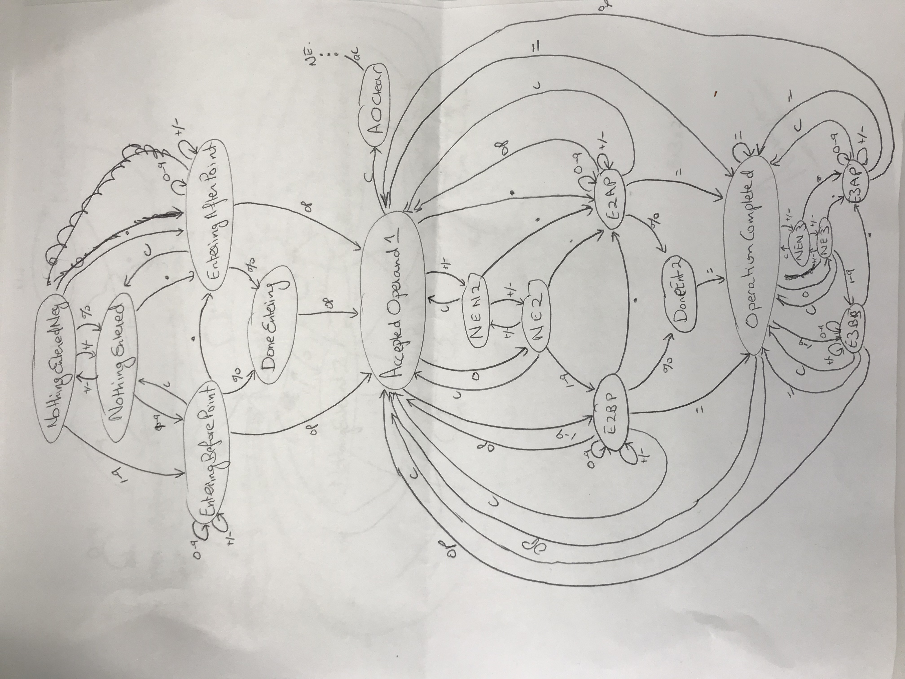

# Calc

This is a reproduction of Apple's calculator app. 

The behavior of the traditional calculator is a lot more complicated than it first seems. A conditional-based approach to this app would make the code very difficult to follow and prone to bugs. A state machine is much better suited for problems of this nature. 

## My approach 

- Create a generic state machine that could be used with other projects. 
- Sketch out the state machine that mimics the behavior of the traditional calculator app.
- Create a specific instance of the state machine for the calculator.
- Add the states and transitions to the state machine object.
- Write test cases to specify acceptance criteria for the calculator state machine. 
- Continue adding states and transitions and test cases until the calculator behavior is properly implemented. 
- Create the UI
    + Every button tap corresponds to a transition in the state machine object

## State Machine

The state machine diagram is shown [here](stateMachine.jpg). I didn't have time to sketch the state machine electronically, but a work in progress is available [here](StateMachine.graffle). 

## Possible enhancements

- Add support for an identifier to each transition. That way I could make sure that a transition hasn't been 'missed.' It would make logging easier as well.
- Add the ability to copy all transitions from one state to another state. This is just a convenience method.
